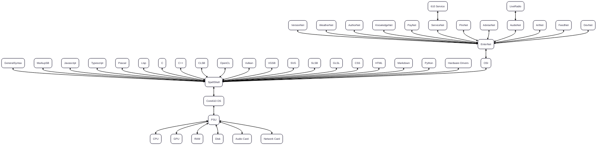

# core610

This is a visualization of a fantasy of mine.. A future OS & Kernel featuring a dedicated network. It almost looks like the holy grail!

Enjoy!

```mermaid
---
config:
  theme: redux
---
flowchart TD
    6("SpellShell") <--> Ö("Core610 OS")
    K("GeneralSyntax") <--> 6
    L("MarkupSB") <--> 6
    D("Javascript") <--> 6
    J("Typescript") <--> 6
    I("Pascal") <--> 6
    H("Lisp") <--> 6
    E("C") <--> 6
    F("C++") <--> 6
    V("CLSB") <--> 6
    U("OpenCL") <--> 6
    T("Vulkan") <--> 6
    P("VGSB") <--> 6
    O("SVG") <--> 6
    M("SLSB") <--> 6
    N("GLSL") <--> 6
    C("CSS") <--> 6
    Ö <--> 0("PSU")
    0 <--> 1("CPU") & 2("GPU") & 3("RAM") & 4("Disk") & 5("Audio Card") & 7("Network Card")
    B("HTML") <--> 6
    R("Markdown") <--> 6
    S("Python") <--> 6
    Z("Hardware Drivers") <--> 6

    9("OSI") <--> 6
    10("EnterNet") <--> 9
    11("VersionNet") <--> 10
    12("WeatherNet") <--> 10
    13("AuthorNet") <--> 10
    14("KnowledgeNet") <--> 10
    15("PayNet") <--> 10
    16("ServiceNet") <--> 10
    17("PrivNet") <--> 10
    18("AdviseNet") <--> 10
    19("AudioNet") <--> 10
    20("ArtNet") <--> 10
    31("FeedNet") <--> 10
    32("DevNet") <--> 10
    33("610 Service") <--> 16
    34("LiveRadio") <--> 19
    
```
