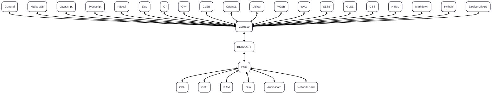

# core610

This is a visualization of my kernel fantasy.. It almost looks like the holy grail!

Enjoy!

```mermaid
---
config:
  theme: redux
---
flowchart TD
    6("Core610") <--> Ö("BIOS/UEFI")
    K("General") <--> 6
    L("MarkupSB") <--> 6
    D("Javascript") <--> 6
    J("Typescript") <--> 6
    I("Pascal") <--> 6
    H("Lisp") <--> 6
    E("C") <--> 6
    F("C++") <--> 6
    V("CLSB") <--> 6
    U("OpenCL") <--> 6
    T("Vulkan") <--> 6
    P("VGSB") <--> 6
    O("SVG") <--> 6
    M("SLSB") <--> 6
    N("GLSL") <--> 6
    C("CSS") <--> 6
    Ö <--> 0("PSU")
    0 <--> 1("CPU") & 2("GPU") & 3("RAM") & 4("Disk") & 5("Audio Card") & 7("Network Card")
    B("HTML") <--> 6
    R("Markdown") <--> 6
    S("Python") <--> 6
    Z("Device Drivers") <--> 6
    
```
